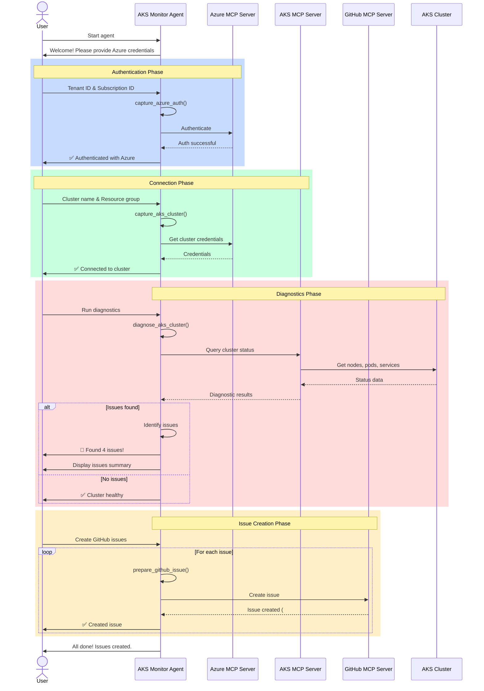

## Workflow Steps

### 1. Authentication
- User provides Azure tenant ID and subscription ID
- Agent stores credentials using `capture_azure_auth` tool
- Azure MCP server validates credentials

### 2. Cluster Connection
- User provides AKS cluster name and resource group
- Agent stores cluster info using `capture_aks_cluster` tool
- Connection to AKS cluster established via Azure MCP

### 3. Diagnostics
- Agent runs `diagnose_aks_cluster` tool
- Checks performed:
  - Node health (Ready/NotReady)
  - Pod status (Running/Failed/Pending)
  - Service health
  - Resource utilization (CPU/Memory/Disk)
- Issues identified and categorized by severity

### 4. Issue Reporting
- For each issue found:
  - Agent prepares formatted issue using `prepare_github_issue` tool
  - Creates GitHub issue via GitHub MCP server
  - Applies appropriate labels (severity, category)
  - Includes recommended actions

### 5. Completion
- User receives summary of all issues created
- GitHub repository now has tracking issues for all problems
- DevOps team can begin remediation