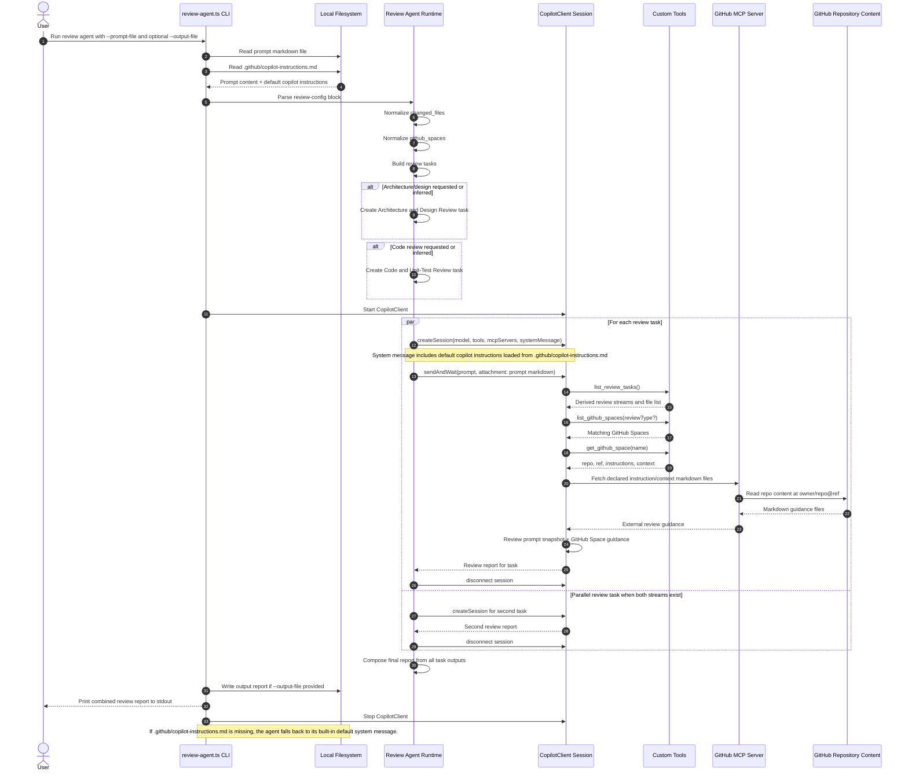

# Review Agent Sequence Diagram

## Notes

- The prompt file is still the primary request contract for PR metadata, changed files, and GitHub Spaces.
- The agent now loads default review behavior from `.github/copilot-instructions.md` automatically.
- GitHub Spaces provide external review guidance through GitHub MCP and are applied per review stream.
- When both architecture/design and code review are inferred, the agent runs both tasks in parallel and merges the outputs into one report.